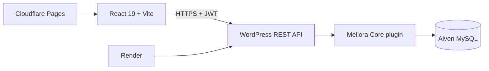

# Meliora Hub

[](https://github.com/Nexalux/meliora-hub/actions/workflows/ci.yml)
[](https://react.dev/)
[](https://developer.wordpress.org/rest-api/)
[](https://meliora-hub.pages.dev/)

Meliora Hub is a full-stack learning-roadmap platform for exploring structured technology paths, tracking progress step by step, and returning to the right place across multiple roadmaps.

**[Open the live application](https://meliora-hub.pages.dev/)** | **[View the API](https://meliora-hub-api.onrender.com/wp-json/meliora/v1/roadmaps)**

> The backend runs on Render's free tier and may need a short cold start after inactivity.

## Highlights

- Browse, search, filter, and paginate technology roadmaps.
- Open complete roadmap details without signing in.
- Follow structured steps with skills, goals, durations, and curated resources.
- Register and sign in with JWT-backed WordPress authentication.
- Bookmark roadmaps and manage a personal saved list.
- Mark individual roadmap steps complete and see progress percentages.
- Resume learning from a dashboard ordered around recent progress.
- Review recent activity, completion totals, streaks, and recommendations.
- Use responsive loading skeletons designed to minimize layout shift.
- Redirect anonymous users to sign in only when they attempt a private action.

## Architecture



The React application is deployed independently from WordPress. A custom WordPress plugin owns roadmap content, user learning state, bookmarks, dashboard aggregation, validation, and REST endpoints. Production requests cross an explicit CORS allowlist and authenticated endpoints require a valid user session.

More detail is available in [Architecture](docs/Architecture.md), [API](docs/API.md), and [Database](docs/Database.md).

## Technology

| Area | Technology |
| --- | --- |
| Frontend | React 19, React Router 7, Vite 7, CSS, React Icons |
| Testing | Vitest, Testing Library, jsdom, ESLint |
| Backend | WordPress, PHP, custom REST API, JWT Authentication for WP REST API |
| Data | MySQL, WordPress content tables, custom bookmark and learning tables |
| Hosting | Cloudflare Pages, Render, Aiven MySQL |
| Delivery | GitHub Actions, Render Blueprint, Docker |

## Repository layout

```text
meliora-hub/
|-- frontend-react/          React application, tests, and UI styles
|-- backend-wordpress/       Canonical Meliora Core WordPress plugin
|-- deploy/render/           Production WordPress container configuration
|-- scripts/                 Local sync, migration, and backend checks
|-- docs/                    Architecture, API, database, and project notes
|-- .github/workflows/       CI and Cloudflare deployment workflow
`-- render.yaml              Render Blueprint for the backend
```

## Run locally

### Requirements

- Node.js 22+
- npm
- PHP 8+
- A local WordPress installation with MySQL (XAMPP is supported)
- The JWT Authentication for WP REST API plugin

### 1. Install and run the frontend

```powershell
cd frontend-react
Copy-Item .env.example .env.local
npm install
npm run dev
```

Set `VITE_WP_REST_URL` in `.env.local` to the REST root of your local WordPress installation:

```dotenv
VITE_WP_REST_URL=http://localhost:8080/meliorahub/wp-json
```

### 2. Install the WordPress plugin

Copy `backend-wordpress/meliora-core` into your local WordPress `wp-content/plugins` directory and activate **Meliora Core**. On the original Windows/XAMPP setup, the included sync script performs that copy:

```powershell
powershell -ExecutionPolicy Bypass -File .\scripts\sync-wordpress-plugin.ps1
```

Configure WordPress permalinks, activate the JWT plugin, and add the frontend origin to `MH_ALLOWED_ORIGINS` when the two applications use different origins. See the [backend guide](backend-wordpress/README.md) for the CORS example.

### 3. Add roadmap content

Use the WordPress admin area to create roadmap posts, assign category and difficulty taxonomies, and build their steps and resources through the Meliora Core editor.

## Quality checks

Run the frontend checks from `frontend-react`:

```powershell
npm run lint
npm test
npm run build
npm audit --audit-level=high
```

With the local WordPress stack running, check the backend from the repository root:

```powershell
powershell -ExecutionPolicy Bypass -File .\scripts\test-backend.ps1
```

Pull requests run frontend linting, unit tests, a production build, dependency auditing, PHP syntax checks, and a production Docker image build. A successful merge to `main` deploys the frontend to Cloudflare Pages.

## API overview

The custom API is namespaced under `/wp-json/meliora/v1`.

| Access | Endpoint group | Purpose |
| --- | --- | --- |
| Public | `GET /roadmaps` | List available roadmaps |
| Public | `GET /roadmaps/{id}` | Return a complete roadmap |
| Public | `POST /register` | Create a learner account |
| Authenticated | `/bookmarks` | List, add, and remove saved roadmaps |
| Authenticated | `/learning` | Read and update step completion |
| Authenticated | `GET /dashboard` | Aggregate stats, activity, progress, and recommendations |

See [docs/API.md](docs/API.md) for the full route table.

## Production deployment

- **Frontend:** Cloudflare Pages at [meliora-hub.pages.dev](https://meliora-hub.pages.dev/)
- **Backend:** Render at [meliora-hub-api.onrender.com](https://meliora-hub-api.onrender.com/)
- **Database:** Aiven MySQL over a TLS-verified connection

The backend can be recreated from `render.yaml`; environment values and the Aiven CA certificate must be supplied through the hosting providers and must never be committed. Deployment details are documented in [deploy/render/README.md](deploy/render/README.md).

## Project status

Meliora Hub reached its portfolio-ready production baseline in August 2026. Future ideas are recorded separately in [docs/Roadmap.md](docs/Roadmap.md); they are not unfinished requirements for the current release.

## Author

Designed and developed by **Tanishq Chaudhary** ([@Nexalux](https://github.com/Nexalux)).

## License

No license is currently granted. The source is publicly viewable for portfolio and evaluation purposes once the repository is published. See [LICENSE](LICENSE).
