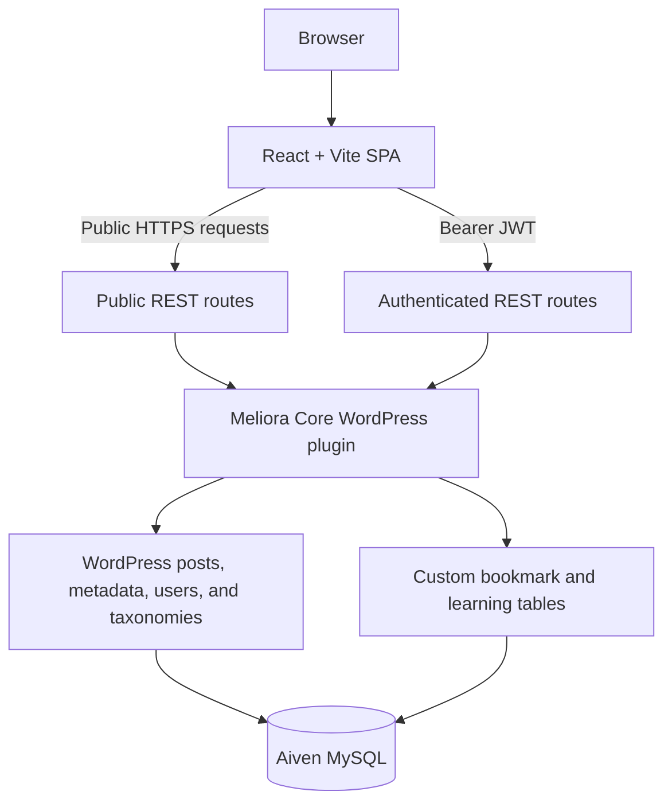

# Architecture

Meliora Hub separates its presentation layer from its content and learning API.

## Frontend

`frontend-react` is a React 19 single-page application built by Vite. React
Router owns public and protected routes, context providers manage authentication,
bookmark, and learning state, and all network traffic passes through the shared
API client in `src/api/client.js`.

The public home and roadmap-detail routes work without authentication. The
dashboard and bookmark pages are protected, while private actions initiated on
public pages preserve the destination and redirect anonymous users to sign in.

## Backend

`backend-wordpress/meliora-core` is a custom WordPress plugin and the canonical
backend source. It provides:

- a `roadmap` custom post type;
- category and difficulty taxonomies;
- structured roadmap, step, and resource metadata;
- REST controllers for roadmaps, bookmarks, learning progress, registration,
  and dashboard aggregation;
- database installation and safe schema upgrades;
- input validation, permissions, rate limiting, and CORS handling.

JWT token creation and validation are supplied by the JWT Authentication for WP
REST API plugin. Meliora Core uses WordPress's authenticated user context after
that plugin validates a bearer token.

## Data

Roadmap content uses WordPress posts, post metadata, and taxonomy tables. User
state uses two custom tables: `{prefix}bookmarks` and `{prefix}learning`. The
production table prefix is `mh_`.

## Production

- Cloudflare Pages hosts the static React build.
- Render runs an immutable WordPress Docker image.
- Aiven provides persistent MySQL storage with CA-verified TLS.
- GitHub Actions validates pull requests and deploys the frontend after a
  successful merge to `main`.

The backend accepts cross-origin API requests only from origins configured in
`MH_ALLOWED_ORIGINS`. Secrets and the Aiven CA certificate are injected by the
hosting providers rather than stored in Git.
